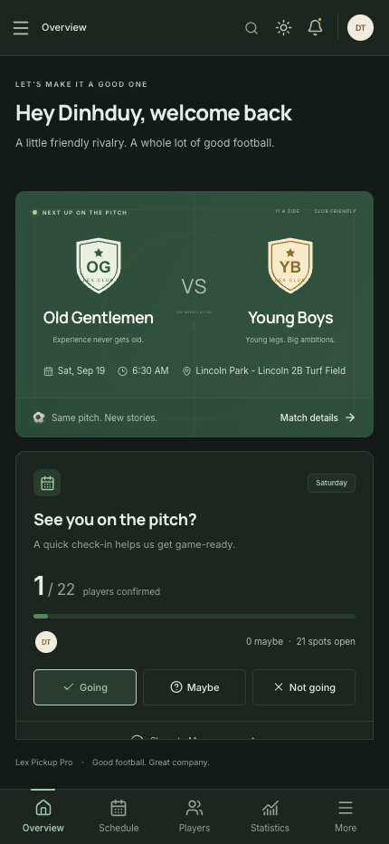
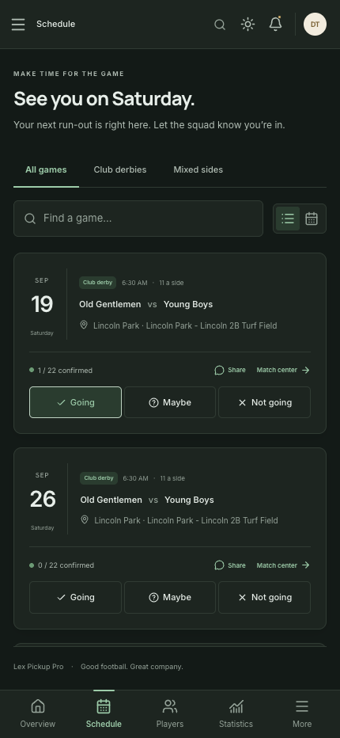
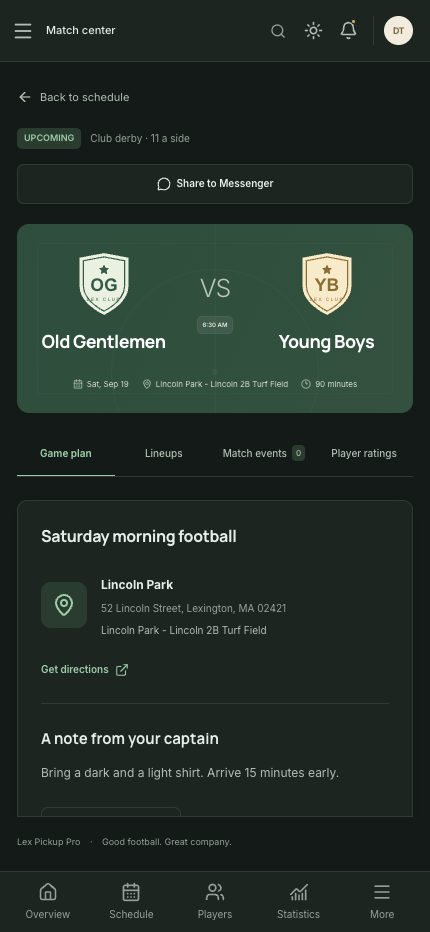
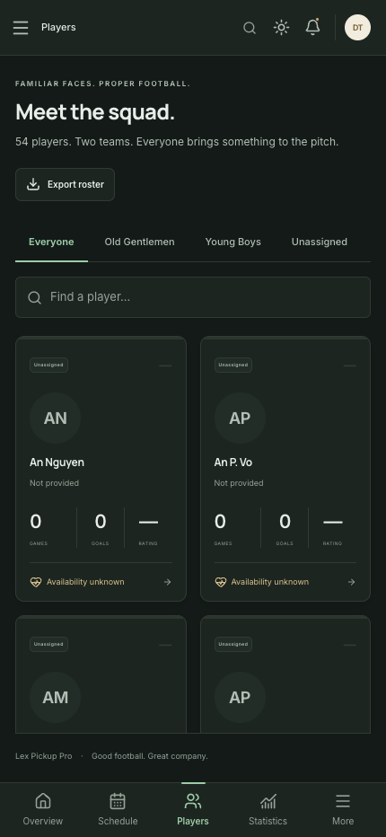
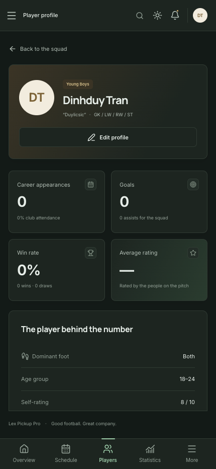
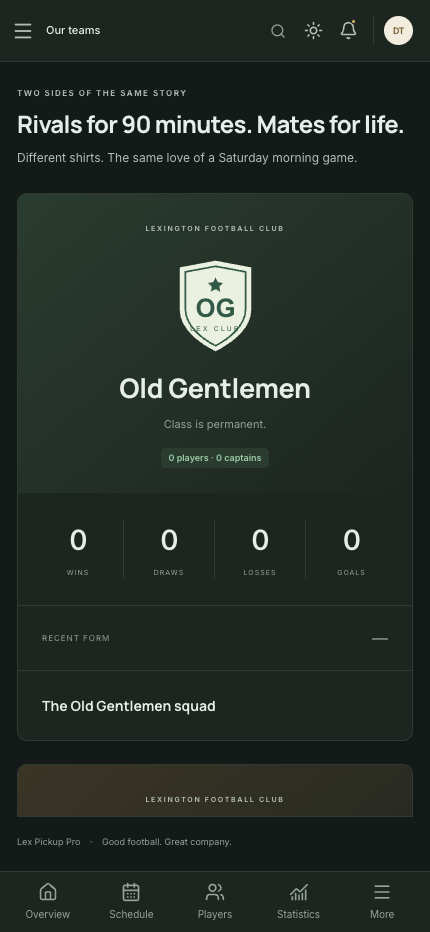
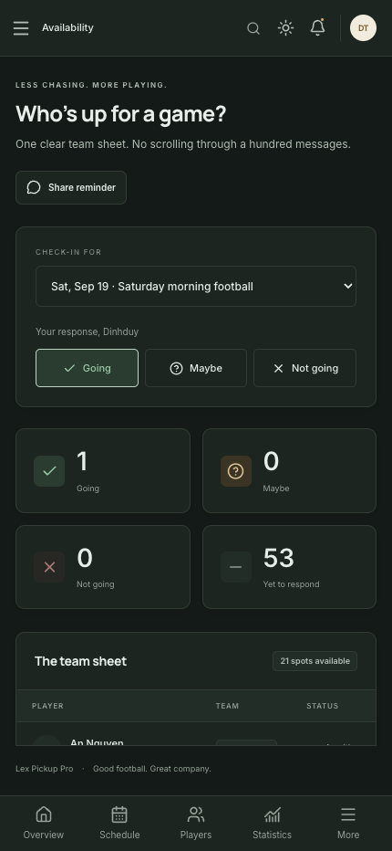
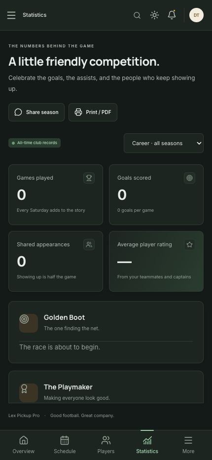
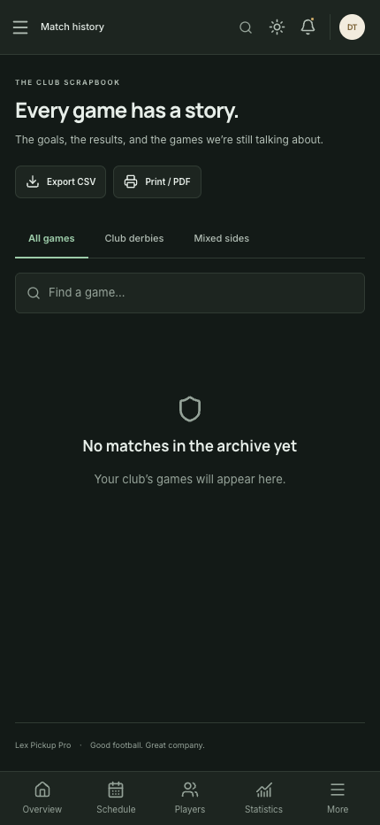
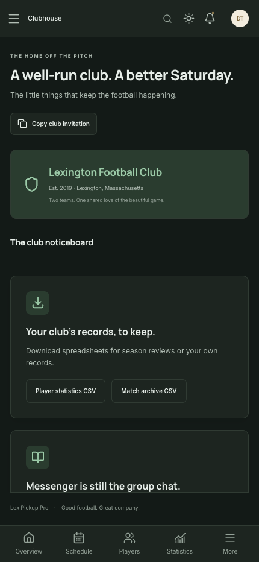

# Lex Pickup Pro

A mobile-first app for organizing recreational football with your club.

Built for quick match planning, team coordination, and tracking the season without needing a group chat to do the work.

## What this app is

Lex Pickup Pro helps a club manage:

- upcoming fixtures and RSVPs
- player profiles and team membership
- match details, locations, and lineup updates
- stats and history across the season
- club communication and sharing

## Screens

### 1. Overview

The Overview screen is the club home. It shows the next match, current reminders, and quick RSVP actions.



### 2. Schedule and match RSVP

The Schedule view helps members review upcoming games and confirm whether they are in, maybe, or out.



### 3. Match center

The Match Center shows the time, pitch, notes, and availability summary for a selected game.



### 4. Players and squad

The Players screen makes it easy to find teammates and open player details.



### 5. Player profile

Each player profile includes availability, positions, stats, and recent form.



### 6. Teams

The Teams view gives the club a clear view of how the roster is structured.



### 7. Availability

Availability helps captains and members track who is available for upcoming games.



### 8. Analytics and statistics

The Analytics screen shows club trends and player performance over time.



### 9. Match history

The Match History screen keeps a record of earlier games and results.



### 10. Club management

The Club screen is where admins share the club invitation and manage important club information.



## Quick start

1. Open the app and check the next game on the Overview screen.
2. Use Schedule to confirm your availability.
3. Open a Match Center to review the details and team sheet.
4. Use Players to find teammates and view profiles.
5. Visit Club to manage club information and records.

## Notes

- This app is designed for quick mobile use before kickoff and during match planning.
- It is focused on making a recreational club feel organized, connected, and easy to run.

See the full guide in [docs/usage/USERGUIDE.md](docs/usage/USERGUIDE.md).


### Administrators

- Add roster-only players through **Players → Add player**.
- In **Club management**, select **Invite** beside a roster-only player. Enter their email and share the generated link privately. It expires in 7 days and claims the existing profile, preserving history and avoiding duplicate players. Generating a new link invalidates the previous one.
- Alternatively, a new member can register with the club invitation code, creating a new profile.
- Use **Edit** to change primary team, role, or active status. Captains and admins can organize all club games; only admins can manage club access. An admin cannot demote or deactivate their own account.
- Deactivated accounts cannot sign in. Completed-game records remain available.
- Post pitch/equipment notices, export records, or start a new season. New games use the active season; existing matches keep their original season.

## How statistics work

- **Appearances:** a player is in a completed game’s saved lineup.
- **Wins / form:** follow the actual side played, even when the player borrows a shirt or joins mixed sides. Form is ordered by kickoff time.
- **Goals / assists:** attributed goal events in completed games. Own goals affect the score but do not count toward the scorer’s Golden Boot total.
- **Clean sheets:** every participating player receives one when their side concedes no goals. This is a team clean-sheet participation metric, not a goalkeeper-only statistic.
- **Rating:** average of submitted participant/organizer ratings; one editable rating per author/player/game. Self-ratings after a game are blocked.
- **Attendance:** appearances divided by completed club games in the selected period.
- **Reliability:** appearances following a Going response divided by all Going responses for completed games; blank if there are no such responses.
- **Head-to-head:** classic Old Gentlemen vs Young Boys games only. Mixed games still count toward individual and overall club statistics.
- **Achievements:** derived from recorded performance. Profile achievements include double-digit goals, club regular, Iron Man, and an 8+ average rating. Golden Boot and Playmaker leaders are displayed in statistics.

The overview uses the active season; profiles show career statistics. The analytics screen can select a season or all-time records. CSV player exports are career totals and are labelled accordingly. Print a selected analytics view to save that season as PDF.

## Messenger and reminders

The app complements your existing group. It does **not** impersonate a Facebook account or automatically post to personal Messenger group chats. On supported phones, Messenger may be chosen from native sharing; otherwise paste the copied summary into Messenger. Links require club sign-in and return members to the requested match.

Preview reminders for games in the next 24 hours:

```bash
cd backend
uv run python -m app.reminders
```

For automatic delivery to an integration you own, set `REMINDER_WEBHOOK_URL` to an HTTPS endpoint and `REMINDER_WEBHOOK_SECRET`, then schedule `python -m app.reminders --deliver` hourly. Payloads use `X-Lex-Signature` (HMAC-SHA256 of the raw body) and an `Idempotency-Key`. Successful deliveries are deduplicated; the receiver must also honor idempotency to handle retries after a partial job failure. Integration details are in [docs/DEPLOYMENT.md](docs/DEPLOYMENT.md).

## Build and verification

```bash
# Backend
cd backend
uv run ruff check app tests
uv run pytest -q
uv run alembic check

# Frontend (from the repository root)
cd frontend
npm run lint
npm run build
npx playwright install chromium
npm run test:e2e
```

Browser tests start their own disposable SQLite database and servers on ports **8017** and **5187**. They exercise desktop and mobile workflows, including accessibility checks, and remove the temporary database afterward. They do not use your regular development database. `E2E_BASE_URL` can point tests at an explicitly disposable running deployment instead; tests create and modify records there.

CI runs backend tests, frontend lint/build, browser tests, and publishes container images to GHCR. The production frontend is written to `frontend/dist`; `npm run preview` serves it for local inspection. PWA installation and service-worker caching are enabled in production builds, not the Vite development server. `npm run format` formats the frontend; `uv run ruff format app tests alembic` formats Python.

## Project structure

```text
backend/
  app/               # API, shared analytics, schemas, auth and operational CLIs
    domain/          # Provider-independent records and club validation
    storage/         # SQL/Cosmos adapters, command receipts and provider selection
    migrate_storage.py # Offline verified exports, resumable imports and reverse recovery
  alembic/versions/  # Versioned, reversible database migrations
  tests/             # API, authorization, business rules and reminder tests
  pyproject.toml      # Python dependencies; uv.lock pins resolved versions
  Dockerfile
frontend/
  src/components/    # Shared controls, app shell, scheduling and sharing dialogs
  src/pages/         # Dashboard, matches, roster, teams, analytics, availability and club tools
  src/api.ts         # Credentialed API client and query cache
  src/types.ts       # Frontend domain types
  public/            # PWA icons
  e2e/               # Playwright desktop/mobile tests
  Dockerfile
  nginx.conf
docs/
  ARCHITECTURE.md
  DEPLOYMENT.md
compose.yaml
.github/workflows/ci.yml
```

## Scope and operational notes

This application contains working local and deployment source; production readiness also depends on your hosting configuration and operational checks. Configure PostgreSQL or the optional Cosmos provider, HTTPS, backups, and the supplied acceptance checks before opening a real club. Configuration rejects the default signing secret, insecure cookies, demo mode, and default invitation code in production.

Photos use HTTPS URLs rather than file uploads. PDF export uses the browser’s print dialog. There is no payment collection, financial ledger, automatic email service, social login, or Messenger bot. Password recovery is administrator-assisted through the documented CLI. Static PWA assets are cached; authenticated API data is not cached by the service worker, and offline edits are not queued. A shared rate limiter is required before running multiple API workers.


**2026 GPT-6-Astra | Codex | VS Code**
