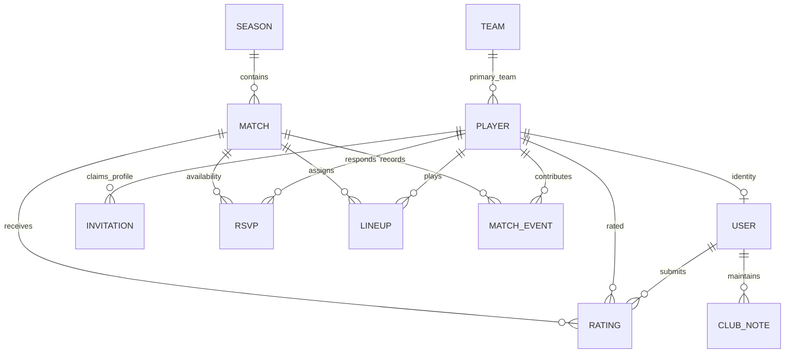

# Lex Pickup Pro architecture

## System

The installable React 19 application talks to a versioned FastAPI API at `/api/v1`.
Vite proxies API requests in development; nginx serves the compiled frontend and
proxies API requests in Docker. TanStack Query owns server state. React Router
provides bookmarkable views. Tailwind and shared accessible components provide
the UI; Recharts renders statistics. The service worker caches static assets only,
never authenticated API responses. Offline changes are not silently queued.

FastAPI validates all requests with Pydantic v2. SQLAlchemy 2 maps relational data,
and Alembic owns schema changes. SQLite is supported for local development and
PostgreSQL is the deployment database. UTC timestamps are converted for display;
the club's schedule uses America/New_York for recurring games, including DST.

## Identity and authorization

Users have a player profile and a player, captain, or admin role. Passwords use
Argon2. Expiring JWTs are stored in HttpOnly, SameSite cookies; production requires
Secure cookies and a strong signing secret. Browser mutations validate Origin.
Captains organize games and edit lineups and results. Administrators also manage
members and club notes. Users can edit their own profile, RSVP, and submit ratings.
Registration requires a configured club invitation code or an email-bound, single-use roster invitation. Logout, password recovery, and privilege changes revoke sessions through a per-user version. Demo seeding is explicit.

## Relational model

There are exactly two primary teams: Old Gentlemen (forest green) and Young Boys
(amber). Primary membership is stable. Each lineup independently assigns a player
to a home or away side, so borrowing players and mixed games never change roster
membership. A player can appear only once in each game's lineup and RSVP board.
Recorded scores are authoritative; event entry provides attribution. Goal events
cannot exceed a completed result. Own goals count for the opposing side. Ratings
are one per author/player/match. Career and season statistics derive from completed
matches and their lineups, events, and ratings; mixed games do not count as fixed-team
head-to-head results. Attendance is actual completed-game lineup participation;
reliability compares promised attendance with participation.

## Main flows

1. **Player:** sign in → next session → RSVP → view lineup/location → inspect
   personal statistics → share a game or result using native share or copied text.
2. **Captain:** create a game or weekly series → review RSVPs → use balanced sides
   or drag players onto the pitch → record score/events → complete the game → share.
3. **Admin:** add players and invitation instructions → assign teams/roles →
   maintain equipment/pitch notes → export player or match CSV and print reports.

## Communication and reminders

Share summaries contain a human-readable date, location, attendance, result when
available, and a deep link. Native Web Share can target Messenger when installed;
copy is always available. Messenger does not support arbitrary automatic posting
to a personal group chat. A CLI reminder job finds matches in the next 24 hours,
prints forwardable reminders, and optionally POSTs to an explicitly configured
webhook with an HMAC signature. Successful webhook deliveries are deduplicated.
No Facebook credentials are stored. Calendar downloads work with phone calendars.

## Deployment and limits

Use HTTPS, PostgreSQL, backups, a unique invitation code, and a strong JWT secret.
Run migrations once before starting workers. The API's in-process login limiter is
appropriate for one worker; deployments with multiple workers need a shared edge
rate limiter. Uploaded files and chatbots are deliberately absent: profile photos
are optional HTTPS image URLs, and communication uses OS sharing/copy. PDF export
uses the browser's print-to-PDF dialog. The seeded demo and all local data stay in
the selected database.

## Real roster imports

`Player.team_id` and optional playing attributes can be null. Unassigned players remain in the shared pool; mixed match sides are independent of primary membership. A captain/admin can change primary team through `PATCH /api/v1/players/{id}/team`, without access to account-role controls.

`PlayerImport` links one generated import UUID to one existing or newly created player, recording the source namespace, source-name hash and file fingerprint. The CLI previews local exports and requires a reviewed manifest to apply a single transaction. Repeated imports preserve profile edits. Messenger roles never produce app accounts or permissions. See [the import guide](PLAYER_IMPORT.md) for the identity review and separate database workflow.
