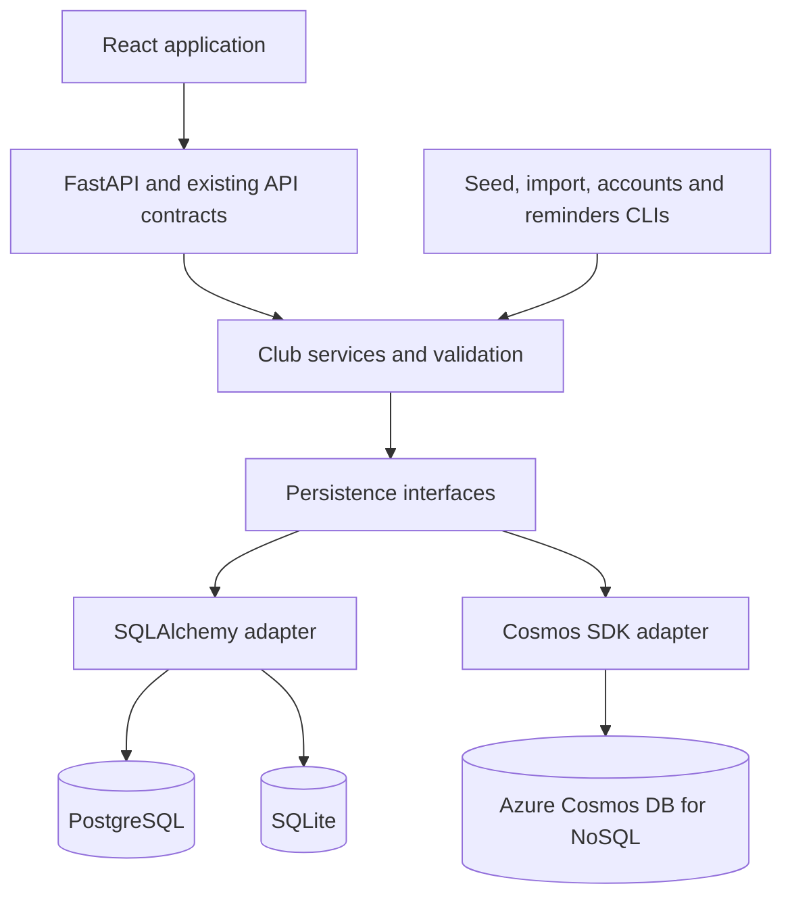

# Plan: optional Azure Cosmos DB deployment

Status: provider implementation completed locally. See [COSMOS_DB.md](COSMOS_DB.md) for setup, migration, validation and remaining Azure rollout checks. Existing PostgreSQL deployments and the real imported roster have not been migrated. The sections below retain the design and acceptance criteria.

## Recommendation and scope

Add **Azure Cosmos DB for NoSQL** as an optional persistence provider. Keep PostgreSQL as the default deployment provider and SQLite for local development. Each running deployment selects exactly one provider; there is no automatic fallback or dual writing between databases.

This assumes a new NoSQL account. An existing Cosmos DB account using a different API needs a separate compatibility decision. Microsoft currently describes **Azure Cosmos DB for PostgreSQL** as being on a retirement path and no longer recommended for new projects; it is not the target of this plan.

Keep the React app, API URLs, integer public IDs, JWT authentication, roles, nullable player details and two-team rules stable. Cosmos implementation details stay behind FastAPI. This requires refactoring persistence: the current routes, authentication, analytics and CLIs use SQLAlchemy sessions, joins, foreign keys, uniqueness constraints and SQL transaction locks directly.

## Architecture



Proposed structure:

```text
backend/app/
  domain/                 # Database-independent records and club rules
  services/               # Auth, roster, matches, analytics and imports
  storage/
    interfaces.py         # Reads and explicit atomic business operations
    factory.py            # Provider selection and client lifecycle
    sql/                  # Existing SQLAlchemy models and operations
    cosmos/               # Documents, queries, batches and schema upgrades
  migrate_storage.py      # Offline export, validation and target import
infra/azure/cosmos.bicep   # Account, database, container and access configuration
compose.cosmos.yaml       # Frontend/backend using a remote Cosmos account
compose.cosmos.local.yaml # Optional local emulator
.env.cosmos.example       # Documented provider configuration
```

Use interfaces such as `get_player`, `list_matches`, `set_rsvp`, `claim_invitation`, `save_match` and `apply_roster_import`. Define each operation's atomicity explicitly instead of emulating an unrestricted SQL session. Return database-independent records and serialize public fields explicitly; Cosmos metadata, password hashes and import provenance never leak into API responses.

Use `azure-cosmos` and `azure-identity`, with one reusable client per worker. The synchronous SDK fits the current synchronous FastAPI endpoints; avoid blocking an async handler with synchronous calls. SQLAlchemy and Alembic remain in the SQL adapter. Cosmos uses versioned documents and an explicit upgrade job, with startup checking compatibility.

## Data model and partition choice

For this single recreational club, use one container, `club_data`, partitioned by **`/club_id`**. All club records share a configured value such as `lex-pickup`. The backend supplies this trusted value; clients cannot select another club through a request parameter. Demo, staging and real club data use separate deployment databases or accounts.

Co-locating this small club's records permits atomic changes across players, accounts, invitations and matches. It deliberately trades horizontal scale within one club for simpler correctness. A logical partition has a documented 20 GB storage limit; throughput also has partition limits that depend on the account mode. Monitor growth and RU usage. A future large, multi-club product would need a separate partitioning design; changing the key requires moving data to a new container.

| Current records | Proposed Cosmos representation |
| --- | --- |
| Teams | `team_1`, `team_2`; preserve Old Gentlemen and Young Boys. |
| Players and player imports | `player_<numeric_id>` with nullable playing attributes and an embedded `import` object containing the existing UUID, source key, fingerprint and timestamp. |
| Users | `user_<numeric_id>` with role, player reference, password hash and session version. |
| Email uniqueness | Deterministic `email_<hash_of_normalized_email>` reservation documents, created atomically with accounts. |
| Invitations | Token-hash-addressed documents, expiry, used state and player/email binding; a per-player invitation pointer identifies the currently valid invitation. |
| Matches, RSVPs, lineups, events and ratings | One `match_<numeric_id>` document containing the match and its related data. Changes use its ETag; public API responses retain the existing shapes and IDs. |
| Seasons and club notes | Separate typed documents. |
| Counters and active season | A club state document, updated conditionally when allocating IDs or switching seasons. |
| Command receipts and reminder delivery | Deterministic operation/dispatch documents for retry reconciliation and delivery tracking. |

Every document has `id`, `club_id`, `kind`, `schema_version` and a required **`identity_key`**. Define a unique-key policy on `/identity_key` when provisioning the container:

- Imported players use `import_<existing_import_uuid>`, preserving the one-import-identity-to-one-player invariant.
- Accounts use `account_player_<player_id>`, enforcing one account per player.
- All other records, including players without imports, use their own namespaced document ID.

This avoids two documents per imported player. Cosmos unique keys are partition-scoped and do not support sparse values; every document must populate this field, with a validated namespace. The policy cannot be changed in place. Only trusted storage code may set it, and normal profile edits must preserve embedded provenance and identity keys.

Keep `player_id`, `match_id`, event IDs and other existing public IDs numeric. Conditional counter updates and record creation occur in the same batch; migrating existing data initializes counters above the largest imported IDs. Document string IDs stay internal.

Match documents simplify atomic RSVP, lineup and scoring changes and avoid relational joins. Their arrays remain subject to the 2 MB item limit. Measure a worst-case club match, enforce a safe encoded-size ceiling before writes, and return a clear validation error on overflow. Never silently truncate history. Splitting unusually large matches is a later schema change.

## Correctness and concurrency

| Workflow | Required Cosmos behavior |
| --- | --- |
| RSVP | Read the match, check kickoff/status/capacity, and conditionally replace it with the new RSVP. On an ETag conflict, reread and revalidate; only the winner can take the final place. |
| Lineups and scoring | Validate against the current match document and player records, then commit conditional changes. Preserve unique player/slot assignments, score bounds and actual home/away attribution. |
| Account and invitation claim | Atomically create the account and email reservation, validate/consume the current invitation, and update the player invitation pointer. Concurrent claims must conflict without leaving partial accounts. |
| Role/activity changes and logout | Update the relevant user/player documents and session version together where needed. Permission checks read current authoritative state. |
| Recurring games and active season | Commit the bounded series or season-pointer change with counters and a command receipt in one batch. |
| Reminder webhook | Claim a dispatch using a conditional lease, send outside the database transaction, then record success. Keep the existing receiver idempotency key; delivery is at least once. |

Use ETag preconditions and transactional batches within the same container and partition. Handle duplicate conflicts, stale versions, throttling and timeouts distinctly. Honor retry delays with bounded retries. Recheck authorization and business rules after conflicts. Use stable command IDs and stored receipts to reconcile an ambiguous timeout after commit; do not blindly replay a goal increment or account creation.

**Consistency is a security decision.** The initial design requires Strong consistency for authoritative account/activity/session-version reads, with a compatible account configuration and single write region. Ordinary Session consistency with separate client caches across API workers does not by itself guarantee immediate visibility of revocations. Do not silently downgrade this requirement. Validate the supported consistency/account-mode combination in the initial Azure spike; if serverless does not meet it, select a compatible provisioned mode. A different revocation design would require explicit review and tests.

## Preserve the roster import guarantees

The current source produced 54 imported players. A literal translation into 54 player documents plus 54 provenance documents would exceed the documented **100-operation transactional batch limit**. Batches also have a **2 MB request limit** and a **5-second execution limit**.

Embedding provenance makes a fresh 54-player import approximately 56 writes: 54 player documents, a counter update and an import receipt. Preflight the actual operation count and serialized request size, including batch overhead, before issuing any writes. Preserve the reviewed manifest, source fingerprint checks, explicit identity matching, Unicode cleanup, collision handling and profile-edit protection.

Rerunning an import resolves the embedded UUIDs and returns unchanged profiles. The container unique-key policy protects against concurrent attempts to map the same import UUID to different players. Reads and writes must still validate an explicit target player when matching.

For the initial Cosmos release, an oversized **live** import fails before making changes and explains the limit. Do not silently split it into independently committed batches: that would break the current all-or-nothing promise. Support for arbitrarily large atomic imports requires a separately designed staging/generation activation mechanism. SQL imports retain their existing larger-file capability. Offline migration into an inactive target can use resumable chunks because the target is not serving the club yet.

## Queries and analytics

- Translate filters to parameterized Cosmos queries scoped to `club_id`; use point reads when both document ID and partition key are known.
- Define indexes from actual queries: kind/name, kind/start time, match status/start time, season/start time and import UUID/source key. Validate composite indexes on Azure.
- Exclude fields from indexing only after reviewing query needs; large free-text notes and password hashes do not need query indexes.
- Compute statistics from completed match documents and their embedded lineups/events/ratings in shared service code. Preserve mixed-game exclusions, attendance, actual-side wins and null ratings.
- Initially use bounded, paginated reads for the club's modest history. Measure RU usage on dashboard, analytics and exports before choosing caches or materialized summaries. Never silently stop at the first result page.
- If summary documents are introduced later, make them rebuildable from match records and define their freshness. They must not determine login permissions or RSVP admission.

## Configuration and deployment

Implemented provider settings:

```dotenv
DATABASE_PROVIDER=cosmos
COSMOS_ENDPOINT=https://<account>.documents.azure.com:443/
COSMOS_DATABASE=lex_pickup_real
COSMOS_CONTAINER=club_data
COSMOS_CLUB_ID=lex-pickup
COSMOS_AUTH_MODE=managed_identity
COSMOS_CONSISTENCY_LEVEL=Strong
```

`DATABASE_PROVIDER=sql` remains the default and uses the existing `DATABASE_URL`. Cosmos mode validates Cosmos settings and does not create an SQL engine, run Alembic or require a PostgreSQL container. Misconfiguration and Cosmos outages fail visibly rather than switching providers.

Use managed identity on Azure and Cosmos **data-plane RBAC** scoped to the application database/container. Separate provisioning permissions from application read/write permissions. Local host development can use an explicitly authorized Azure CLI identity; a Docker container needs its own configured credential path. An emulator key is local-only. Preserve the existing JWT, cookie, CORS and HTTPS requirements; database identity does not replace member authentication.

Use Bicep to provision the account, database, container, immutable partition/unique-key policy, indexes, identity access, network configuration and the chosen backup mode. Runtime startup only checks these resources and document versions. Review serverless versus provisioned/autoscale cost using measured RU consumption, consistency support, backup requirements and the deployment region. Do not assume Cosmos is cheaper for this workload or quote a fixed price without those inputs.

Provide a standalone Cosmos Compose topology for frontend/backend that connects to the Azure endpoint and does not inherit PostgreSQL startup dependencies. Keep the current SQL Compose files working. Change the entrypoint to select the provider's explicit initialization/check path. Add database readiness checks, bounded timeouts, request-charge diagnostics, and alerts for throttling, latency, failures and partition growth. Avoid logging keys, tokens, password hashes or raw member records.

For Docker development, evaluate the Linux vNext emulator on this machine's architecture and pin a tested image version/digest. It has a documented subset of features: batch operations are supported, while RU reporting and custom index enforcement are not equivalent to Azure. Map its endpoint to a free host port such as 18081 because 8080/8081 are already used by the club apps. Emulators must not be the sole test of production behavior; retain an isolated Azure integration suite.

## Migrate the existing real club

1. Inventory and back up the selected real PostgreSQL database. Preserve the existing demo deployment separately.
2. Provision an empty Cosmos target with the final partition/unique-key policies. Keep app traffic on SQL.
3. Run an export/validation dry run: include teams, players, embedded import provenance, seasons, accounts, invitations, matches and club notes that exist at migration time. Preserve IDs, nulls, Unicode, Argon2 hashes, roles and session versions. Avoid plaintext exports of account material; use restricted temporary files or direct streaming.
4. Pause mutations and reminder jobs for final export. Import into the inactive target using deterministic IDs, checksums and a resumable checkpoint. Reconstruct email reservations, invitation pointers and counters; never infer privileges from Messenger roles.
5. Compare every entity count, relationships, import mappings, active season, account-role data and canonical record checksums. Compare statistics and run acceptance workflows against the target.
6. Switch one deployment to Cosmos, resume writes/reminders, and verify health, sign-in, RSVP, profiles, invitations and sharing. Record the migration version and cutover point.
7. Retain the SQL backup. Before any new Cosmos writes, rollback can return to that exact SQL snapshot. After new writes, rollback requires exporting/reconciling those changes first; simply switching back would lose data. Test that recovery path and Cosmos backup restoration.

## Implementation sequence and acceptance

| Phase | Deliverable and exit criterion |
| --- | --- |
| 1. Feasibility spike | A disposable NoSQL account proves Python batch/ETag behavior, unique keys, authoritative auth reads, emulator compatibility, document sizes and RU costs. Select supported throughput/consistency settings. |
| 2. Persistence separation | Move SQL access behind interfaces and shared records. Existing SQLite/PostgreSQL tests and desktop/mobile workflows continue passing. |
| 3. Cosmos reads and identity | Implement roster, teams, seasons, notes, configuration, provisioning, login, invitations and session revocation with contract parity. |
| 4. Cosmos club operations | Implement match aggregates, RSVP, lineups, events, ratings, recurrence, analytics, imports, admin recovery and reminders. |
| 5. Deployment and migration | Add Compose/env templates, Bicep, document upgrades, migration tooling, operator documentation, backups and recovery verification. |
| 6. Controlled rollout | Migrate a test copy, complete parity/concurrency tests, then perform the reviewed real-club cutover. |

Run shared API/service tests against SQL and Cosmos, plus adapter-specific integration tests. Required Cosmos cases include:

- Two concurrent players attempt to take one remaining match place; exactly one succeeds.
- Concurrent invitation claims/email registrations create one account; failure leaves no orphan reservations.
- Two API workers observe role changes, deactivation, logout and password-reset revocations as specified.
- Concurrent score edits and retried goal requests do not lose or duplicate events.
- The 54-player import commits atomically, rolls back on an injected failure, and is idempotent after later profile edits.
- Oversized batches/items fail before partial application; larger offline migration resumes without duplicates.
- Null player attributes, primary teams, public numeric IDs, all stats, CSV safety and Messenger summaries match SQL behavior.
- Throttling, stale ETags, unavailable storage and ambiguous commit responses produce bounded, recoverable behavior.
- Queries paginate correctly; Azure enforces the intended unique/index policies; representative workloads meet agreed latency/RU budgets.
- Upgrade, backup restore and migration rollback preserve the roster, identities, accounts and match history.

No Azure resources or production migration were created during local implementation. Region, account mode, deployment host and operational budgets are rollout inputs, not blockers to preparing the provider implementation.

## References

- [Transactional batches and limits](https://learn.microsoft.com/en-us/azure/cosmos-db/transactional-batch)
- [Service limits](https://learn.microsoft.com/en-us/azure/cosmos-db/concepts-limits)
- [Partitioning](https://learn.microsoft.com/en-us/azure/cosmos-db/partitioning)
- [Unique-key policies](https://learn.microsoft.com/en-us/azure/cosmos-db/unique-keys)
- [ETags and optimistic concurrency](https://learn.microsoft.com/en-us/azure/cosmos-db/database-transactions-optimistic-concurrency)
- [Consistency levels](https://learn.microsoft.com/en-us/azure/cosmos-db/consistency-levels)
- [Data-plane RBAC and identity](https://learn.microsoft.com/en-us/azure/cosmos-db/how-to-connect-role-based-access-control)
- [Serverless behavior](https://learn.microsoft.com/en-us/azure/cosmos-db/serverless)
- [Linux vNext emulator feature support](https://learn.microsoft.com/en-us/azure/cosmos-db/emulator-linux)
- [Cosmos DB for PostgreSQL product guidance](https://learn.microsoft.com/en-us/azure/cosmos-db/postgresql/introduction)
